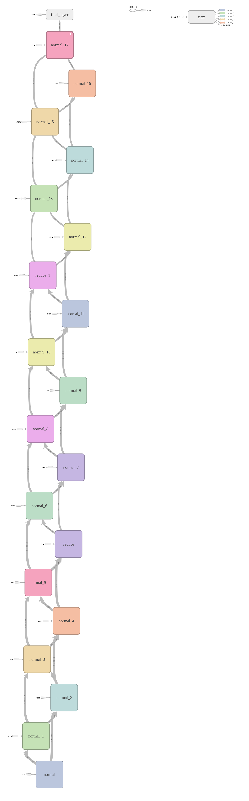

[](https://travis-ci.org/johannesu/NASNet-keras)

# NASNetA-Keras

[Keras](https://keras.io/) implementation of NASNet-A. The best performing model from the paper [Learning Transferable Architectures for Scalable Image Recognition](https://arxiv.org/abs/1707.07012) [1].
An extension of [AutoML](https://research.googleblog.com/2017/11/automl-for-large-scale-image.html) [2].

## Demo

 [demo.ipynb](demo.ipynb) shows how to load a pretrained model and use it to classify an image.


## Other versions
As of version [2.1.3](https://github.com/keras-team/keras/releases/tag/2.1.3) keras includes two versions of [NASNet](https://github.com/keras-team/keras/blob/master/keras/applications/nasnet.py).

If you are

* Only interested in `NASNet-mobile (4 @ 1056)` and/or `NASNet-large (6 @ 4032)`.

* Only interested in using channel last data format.

I would recommend upgrading keras and using the built in version.

### This version


Even after the addition of the built in models, there are still some uses for this project, since it is more general.

* It allows you to create any NASNet-A model. If you want something faster than large and more accurate than mobile.

* It allows you to load pretrained models using either channel last or channel first data format.

* It allows you to load any model trained with Googles' implementation (the weights will be converted).


## Install
System requirements on Ubuntu 16.04

```bash
sudo apt-get install python3-pip python3-tk
```

Install python requirements and the package
```bash
pip3 install https://github.com/johannesu/NASNet-keras/archive/master.zip
```

You can now use the package in python

```python
from nasnet import mobile
model = mobile()
model.summary()
```


### Reference implementation
Googles' tensorflow-slim implementation: [https://github.com/tensorflow/models/tree/master/research/slim/nets/nasnet](https://github.com/tensorflow/models/tree/master/research/slim/nets/nasnet).


### Pretrained weights
Models trained with the reference implementation can be convert to this model.
This includes the two trained models provided by Google [https://github.com/tensorflow/models/tree/master/research/slim/nets/nasnet](https://github.com/tensorflow/models/tree/master/research/slim/nets/nasnet).

* Setup models, download tensorflow checkpoints and convert them to Keras.

```python
import nasnet

# NASNet-A_Mobile_224
model = nasnet.mobile(weights='imagenet')

# NASNet-A_Large_331
model = nasnet.large(weights='imagenet')
```

Converting the checkpoints can take a few minutes, the work is cached and will be fast the second call.


### Model visualization
`NASNet-A (6 @ 768)` from the paper, visualized in tensorboard:




### References
[1]   __Learning Transferable Architectures for Scalable Image Recognition__.
[https://arxiv.org/abs/1707.07012](https://arxiv.org/abs/1707.07012)
_Barret Zoph, Vijay Vasudevan, Jonathon Shlens, Quoc V. Le_.

[2]  __AutoML for large scale image classification and object detection__
[https://research.googleblog.com/2017/11/automl-for-large-scale-image.html](https://research.googleblog.com/2017/11/automl-for-large-scale-image.html)
_Barret Zoph, Vijay Vasudevan, Jonathon Shlens, Quoc V. Le_.